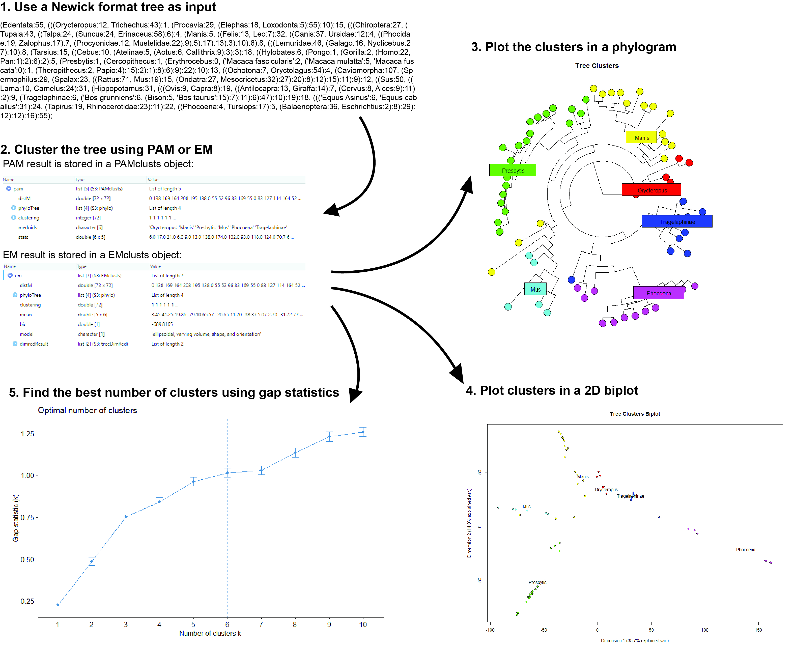

<!-- README.md is generated from README.Rmd. Please edit that file -->

# ClustPhy

<!-- badges: start -->
<!-- badges: end -->

## Description

`ClustPhy` is an R package for clustering phylogenetic trees (using PAM
or EM clustering), comparing different clusterings (using gap
statistics), and visualizing the clusters (in a phylogenetic tree or in
a 2D biplot). This package wsas developed using
`R version 4.1.1 (2021-08-10)`, platform:
`x86_64-w64-mingw32/x64 (64-bit)`, running under:
`Windows 10 x64 (build 19042)`.

## Installation

To install the latest version of the package:

``` r
require("devtools")
devtools::install_github("rainali475/ClustPhy", build_vignettes = TRUE)
library("ClustPhy")
```

To run the Shiny app:

``` r
runClustPhy()
```

## Overview

``` r
ls("package:ClustPhy")
data(package = "ClustPhy")
```

There are 6 functions available in this package. There are 2 clustering
functions: ***clustPAM*** and ***clustEM***. They allow users to input
phylogenetic trees in newick format either as a character string or a
file path and performs clustering via either PAM (k-medoids) or EM
(expectation maximization) algorithms. Users can specify the number of
clusters they want. The functions ***plotClustersTree*** and
***plotClusters2D*** can be used to visualize tree clusters on a
phylogram or a 2D biplot, respectively. Users can specify whether or not
to show a number of designated cluster centers, the symbols used to
represent these centers, and the text size for these symbols.
***plotClusters2D*** first converts the distance matrix of the tree to a
coordinate matrix, then uses principle component analysis to reduce
dimensionality of the matrix to plot data points on a 2-dimensional
plot. The ***compareGap*** function takes as input a distance matrix
representation of phylogenetic tree and outputs a set of gap statistics
for a range from 1 cluster to k.max clusters. This can be used to select
the best clustering scheme for the target tree. The ***plotGapStat***
function takes the gap statistics output from ***compareGap*** and
produces a plot of the gap statistics with a vertical dashed line
representing the best number of clusters.

Refer to package vignettes for more details.

``` r
browseVignettes("ClustPhy")
```

An overview of the package is illustrated below.



## Contributions

The author of this package is Yuzi (Raina) Li. The ***clustPAM***
function makes use of the PAM clustering function in `cluster` to find
clusterings and clusteri statistics. The ***clustEM*** function makes
use of the `mclust` package for EM clustering algorithms. The
***plotClustersTree*** uses plot.phylo function from `ape`.
***plotClusters2D*** uses the algorithm described in
<https://math.stackexchange.com/questions/156161/finding-the-coordinates-of-points-from-distance-matrix>.
to convert the distance matrix to coordinate matrix. ***compareGap***
uses the clusGap function available in `cluster` package to calculate
gap statistics. ***plotGapStat*** uses `factoextra` package to plot the
gap statistics and find the best k value.

## References

R Core Team (2020). R: A language and environment for statistical
computing. R Foundation for Statistical Computing, Vienna, Austria.
<https://www.R-project.org/>

Kaufman, L., & Rousseeuw, P. J. (2005). Finding groups in data: An
introduction to cluster analysis. Wiley.

Legendre17. (1960, August 1). Finding the coordinates of points from
distance matrix. Mathematics Stack Exchange. Retrieved November 17,
2021, from
<https://math.stackexchange.com/questions/156161/finding-the-coordinates-of-points-from-distance-matrix>.

Paradis E, Schliep K (2019). “ape 5.0: an environment for modern
phylogenetics and evolutionary analyses in R.” Bioinformatics, 35,
526-528.

Maechler M, Rousseeuw P, Struyf A, Hubert M, Hornik K (2021). cluster:
Cluster Analysis Basics and Extensions. R package version 2.1.2

Alboukadel Kassambara and Fabian Mundt (2020). factoextra: Extract and
Visualize the Results of Multivariate Data Analyses. R package version
1.0.7. <https://CRAN.R-project.org/package=factoextra>

Scrucca L, Fop M, Murphy TB, Raftery AE (2016). “mclust 5: clustering,
classification and density estimation using Gaussian finite mixture
models.” The R Journal, 8(1), 289–317.
<https://doi.org/10.32614/RJ-2016-021>.

## Acknowledgement

This package was developed as part of an assessment for 2021 BCB410H:
Applied Bioinformatics, University of Toronto, Toronto, CANADA.
