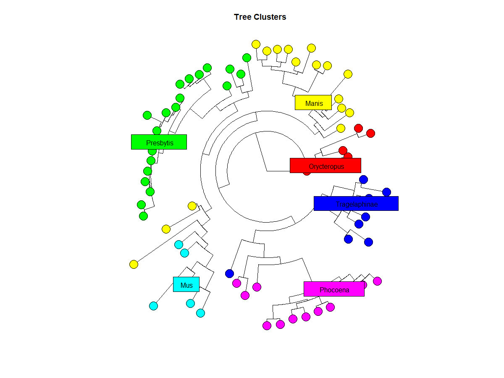

```{r, include = FALSE}
knitr::opts_chunk$set(
  collapse = TRUE,
  comment = "#>"
)
```

```{r setup}
library(ClustPhy)
```

## Introduction

`ClustPhy` is an R package for clustering phylogenetic trees (using PAM or EM 
clustering), comparing different clusterings (using gap statistics), and 
visualizing the clusters (in a phylogenetic tree or in a 2D biplot). This 
document gives a tour of ClustPhy package.

To download **ClustPhy**, use the following commands:

``` r
require("devtools")
install_github("rainali475/ClustPhy", build_vignettes = TRUE)
library("ClustPhy")
```
To list all sample functions available in the package:
``` r
ls("package:ClustPhy")
```

To list all sample datasets available in the package:
``` r
data(package = "ClustPhy")
```

<br>

## Components

There are 6 functions available in this package. There are 2 clustering functions: 
__*clustPAM*__ and __*clustEM*__. They allow users to input phylogenetic trees
in newick format either as a character string or a file path and performs clustering
via either PAM (k-medoids) or EM (expectation maximization) algorithms. Users can
specify the number of clusters they want. 
The functions __*plotClustersTree*__ 
and __*plotClusters2D*__ can be used to visualize tree clusters on a phylogram or
a 2D biplot, respectively. Users can specify whether or not to show a number of 
designated cluster centers, the symbols used to represent these centers, and the
text size for these symbols. __*plotClusters2D*__ first converts the distance
matrix of the tree to a coordinate matrix, then uses principle component analysis
to reduce dimensionality of the matrix to plot data points on a 2-dimensional plot.
The __*compareGap*__ function takes as input a distance matrix representation of 
phylogenetic tree and outputs a set of gap statistics for a range from 1 cluster to
k.max clusters. This can be used to select the best clustering scheme for the target
tree.
The __*plotGapStat*__ function takes the gap statistics output from __*compareGap*__
and produces a plot of the gap statistics with a vertical dashed line representing 
the best number of clusters. 

Here is an example that shows how to use ClustPhy to cluster a tree via EM and PAM: 

```r
> pam <- clustPAM(6, text = NwkTree2)
> str(pam)
List of 5
 $ distM     : num [1:72, 1:72] 0 138 169 164 208 195 173 195 190 196 ...
  ..- attr(*, "dimnames")=List of 2
  .. ..$ : chr [1:72] "Edentata" "Orycteropus" "Trichechus" "Procavia" ...
  .. ..$ : chr [1:72] "Edentata" "Orycteropus" "Trichechus" "Procavia" ...
 $ phyloTree :List of 4
  ..$ edge       : int [1:141, 1:2] 73 73 74 75 76 76 75 77 77 78 ...
  ..$ edge.length: num [1:141] 55 55 15 1 12 43 10 29 55 18 ...
  ..$ Nnode      : int 70
  ..$ tip.label  : chr [1:72] "Edentata" "Orycteropus" "Trichechus" "Procavia" ...
  ..- attr(*, "class")= chr "phylo"
  ..- attr(*, "order")= chr "cladewise"
 $ clustering: Named int [1:72] 1 1 1 1 1 1 2 2 2 2 ...
  ..- attr(*, "names")= chr [1:72] "Edentata" "Orycteropus" "Trichechus" "Procavia" ...
 $ medoids   : chr [1:6] "Orycteropus" "Manis" "Presbytis" "Mus" ...
 $ stats     : num [1:6, 1:5] 6 17 21 6 9 13 138 174 102 93 ...
  ..- attr(*, "dimnames")=List of 2
  .. ..$ : NULL
  .. ..$ : chr [1:5] "size" "max_diss" "av_diss" "diameter" ...
 - attr(*, "class")= chr "PAMclusts"
> em <- clustEM(6, text = NwkTree2)
> str(em)
List of 6
 $ distM     : num [1:72, 1:72] 0 138 169 164 208 195 173 195 190 196 ...
  ..- attr(*, "dimnames")=List of 2
  .. ..$ : chr [1:72] "Edentata" "Orycteropus" "Trichechus" "Procavia" ...
  .. ..$ : chr [1:72] "Edentata" "Orycteropus" "Trichechus" "Procavia" ...
 $ phyloTree :List of 4
  ..$ edge       : int [1:141, 1:2] 73 73 74 75 76 76 75 77 77 78 ...
  ..$ edge.length: num [1:141] 55 55 15 1 12 43 10 29 55 18 ...
  ..$ Nnode      : int 70
  ..$ tip.label  : chr [1:72] "Edentata" "Orycteropus" "Trichechus" "Procavia" ...
  ..- attr(*, "class")= chr "phylo"
  ..- attr(*, "order")= chr "cladewise"
 $ clustering: Named num [1:72] 1 2 1 1 1 1 2 2 2 2 ...
  ..- attr(*, "names")= chr [1:72] "Edentata" "Orycteropus" "Trichechus" "Procavia" ...
 $ mean      : num [1:72, 1:6] 147.2 84.8 98.6 87.6 92 ...
 $ bic       : num -47979
 $ model     : chr "spherical, unequal volume"
 - attr(*, "class")= chr "EMclusts"
```

Then, user can use the __*plotClustersTree*__ function to plot phylograms of both 
clustering schemes: 

```r
### plot the pam clusters
plotClustersTree(pam$phyloTree, pam$clustering, show.centers = pam$medoids, center.symbol = pam$medoids)
### plot the em clusters
plotClustersTree(em$phyloTree, em$clustering)
```

The PAM clusters phylogram: 

<div style="text-align:center">
<div style="text-align:left">

The EM clusters phylogram: 

<div style="text-align:center">
<div style="text-align:left">

User can also use the __*plotClusters2D*__ function to plot the tree data points 
on a 2D plot: 

```r
### plot PAM biplot
dimRedInfoPAM <- plotClusters2D(pam$phyloTree, pam$clustering, show.centers = pam$medoids, center.symbol = pam$medoids)
### plot EM biplot
dimRedInfoEM <- plotClusters2D(em$phyloTree, em$clustering)
```

The dimensionality reduction information are stored in the return object: 

```r
> str(dimRedInfoEM)
List of 2
 $ coordM: num [1:72, 1:64] 0 -131 -130 -131 -131 ...
 $ PCA   :List of 5
  ..$ sdev    : num [1:64] 74.9 48.3 43 38.7 30.2 ...
  ..$ rotation: num [1:64, 1:64] -0.005556 0.999984 -0.000462 -0.000197 0.000484 ...
  .. ..- attr(*, "dimnames")=List of 2
  .. .. ..$ : NULL
  .. .. ..$ : chr [1:64] "PC1" "PC2" "PC3" "PC4" ...
  ..$ center  : num [1:64] -183.728 -0.138 1.741 0.836 -2.375 ...
  ..$ scale   : logi FALSE
  ..$ x       : num [1:72, 1:64] -0.88 8.182 4.913 5.454 0.817 ...
  .. ..- attr(*, "dimnames")=List of 2
  .. .. ..$ : NULL
  .. .. ..$ : chr [1:64] "PC1" "PC2" "PC3" "PC4" ...
  ..- attr(*, "class")= chr "prcomp"
 - attr(*, "class")= chr "treeDimRed"
 ```


The PAM biplot: 

<div style="text-align:center">
<div style="text-align:left">

The EM biplot: 

<div style="text-align:center">
<div style="text-align:left">

Then, user can use __*compareGap*__ to compare the the gap statistics of a range
of different k values for either EM or PAM clustering: 

```r
> set.seed(5)
> gapStat <- compareGap(distM = pam$distM, k.max = 10, method = "PAM")
> gapStat$Tab
          logW   E.logW       gap     SE.sim
 [1,] 9.301620 9.528063 0.2264429 0.02328046
 [2,] 9.027854 9.513619 0.4857655 0.02436181
 [3,] 8.749049 9.499464 0.7504150 0.02475341
 [4,] 8.643027 9.484641 0.8416135 0.02589096
 [5,] 8.509341 9.469505 0.9601636 0.02671524
 [6,] 8.440482 9.454189 1.0137068 0.02681280
 [7,] 8.411061 9.439515 1.0284537 0.02703049
 [8,] 8.290863 9.425372 1.1345085 0.02755661
 [9,] 8.179419 9.409750 1.2303315 0.02800119
[10,] 8.136667 9.394100 1.2574333 0.02723069
```

These gap statistics can be plotted by __*plotGapStat*__:

```r
plotGapStat(gapStat)
```

<div style="text-align:center">
<div style="text-align:left">
